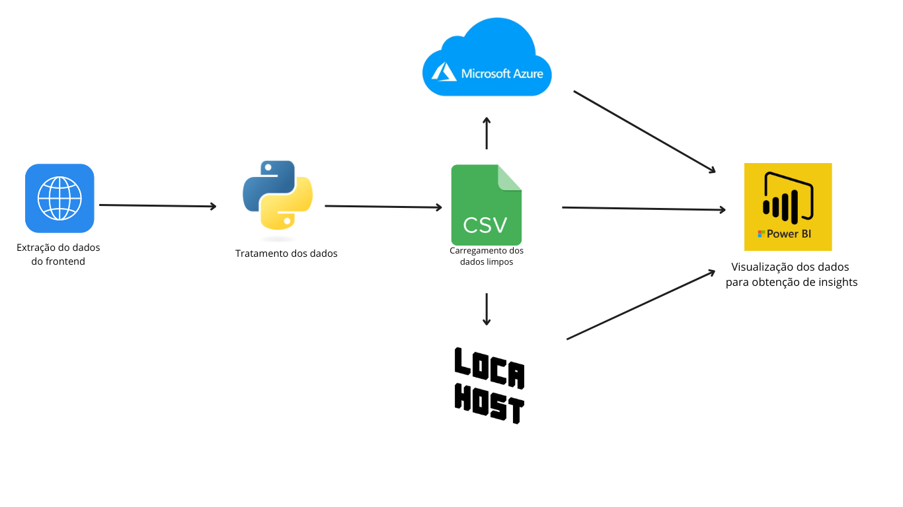

Solução desenvolvida para sanar a seguinte demanda real (TechLeadar necessitava extrair um lista de emails suprimidos que se encontravam em uma lista no aws , como a informação estava disponivel no frontend da pagina , criei um webscraping com beautifulSOup do Python que extraia e limpava esses dados em um arquivo CSV local , o mesmo que arquivo estava sincronizado em tempo real com uma dashboard no PowerBi , dessa forma ficava mais facil e agradavel buscar determinado email e também opter metricas de quantos emails estavam sendo bloqueados por semana , mes ou dia . Tal solução rodou em produção no google Colab e gerando csv localhost ,  porem pode ser facilmente adaptada em ambiente de qualquer cloud . 

